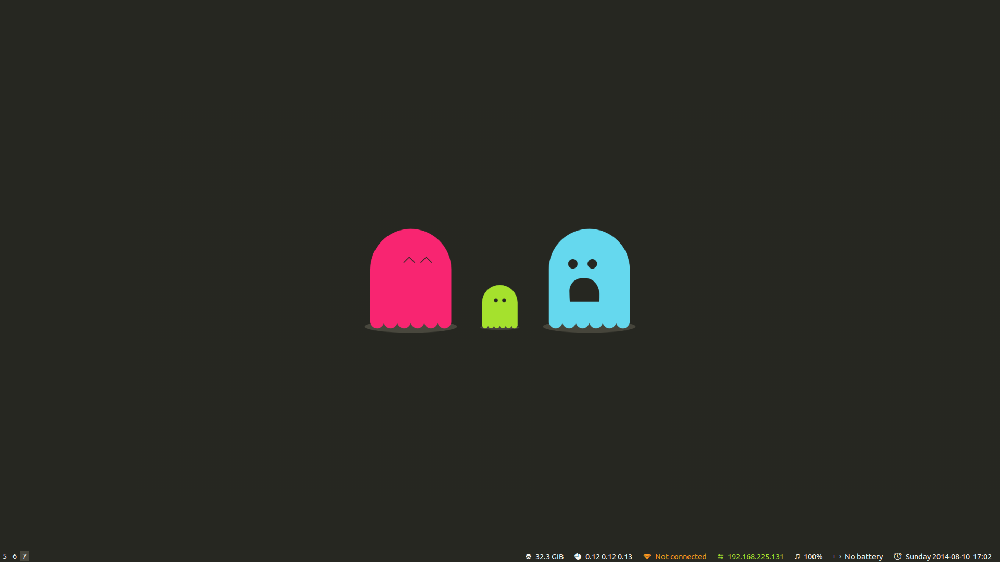

# i3-gnome

Opinionated [i3](http://i3wm.org/) configuration with GNOME Session integration.

## Goodies

* GNOME Session integration.
* Icon font for i3status.
* Monokai color theme for both i3 and i3bar.
* Tweaked keyboard shortcuts.

## Platform Support

* Ubuntu 14.04.1

## Installation

First, make sure to have "git" and "make" installed:

    sudo apt-get install -y git make

Then, clone this repository somewhere:

    cd ~/Downloads
    git clone git://github.com/lvillani/i3-gnome.git
    cd i3-gnome

Install the dependencies:

    sudo make install-deps

Then install the whole thing:

    sudo make install

Now you can log-out of the current session. You will find a new session type called "GNOME + i3",
choose it, log-in and you're done.

If you later want to uninstall i3-gnome, run the following command:

    sudo make uninstall

## Credits

"WTF!" wallpaper by [Agustín Lopini](http://agustinlopini.com.ar/) is licensed under
[CC-BY-SA 4.0](https://creativecommons.org/licenses/by-sa/4.0/)
